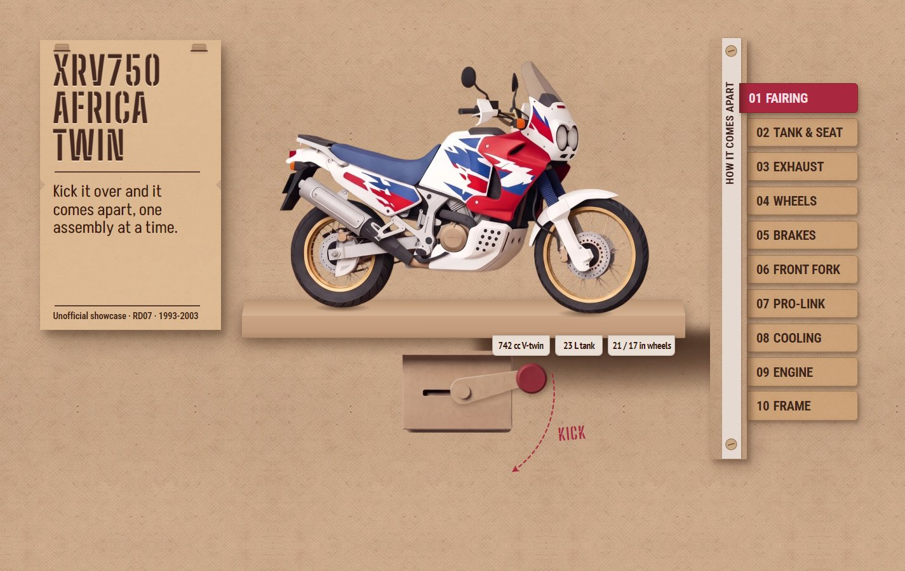
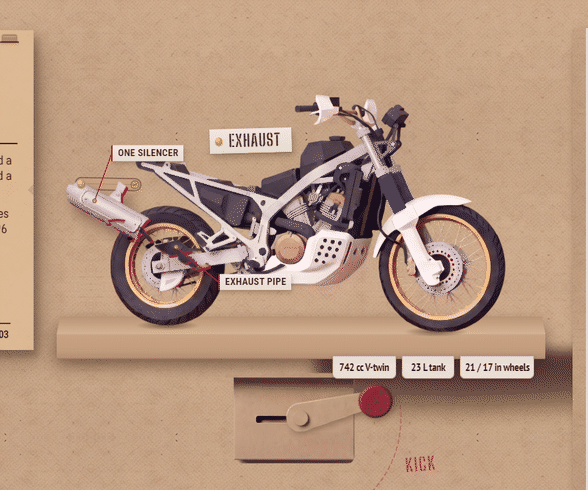
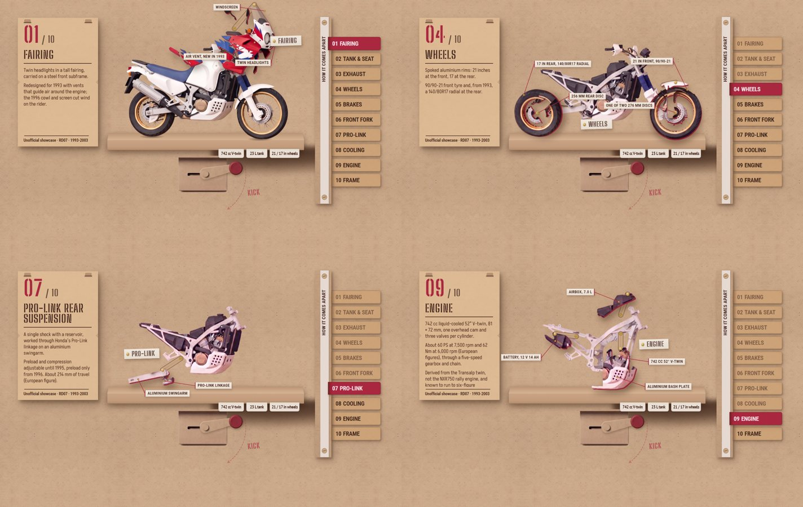
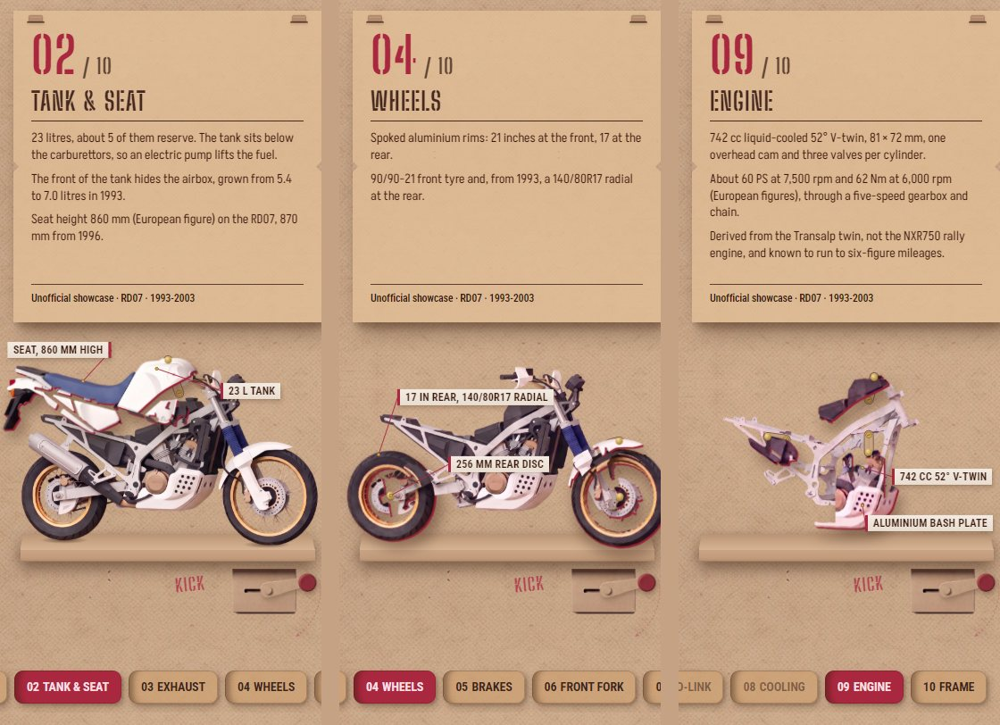
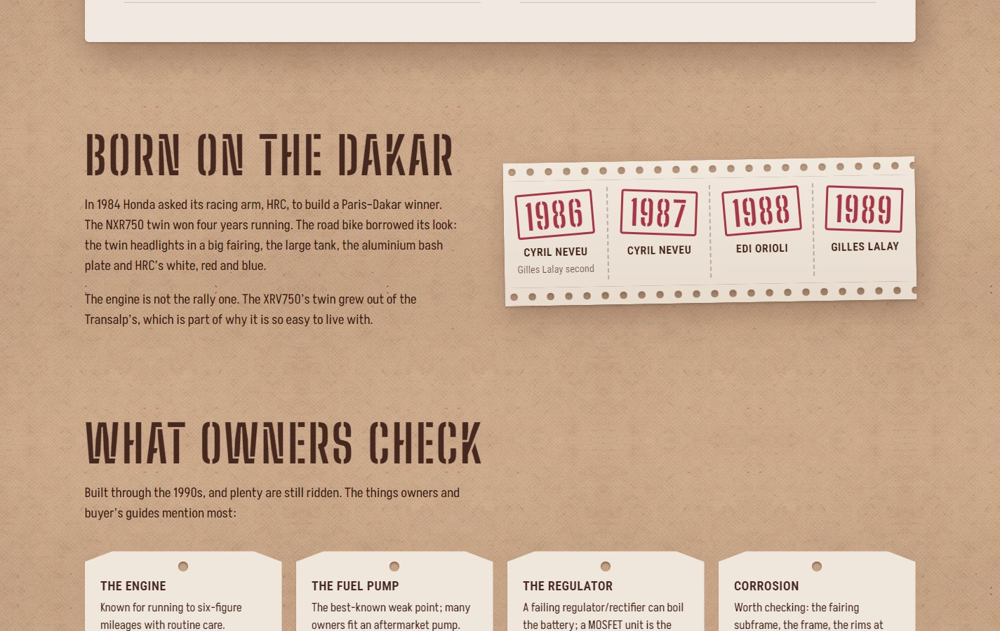

# XRV750 Africa Twin: Take It Apart

An unofficial showcase of one motorcycle, the 1993–2003 Honda XRV750 Africa Twin (RD07). The bike stands alone in the centre as a cut-paper model on a kraft shelf. Yank the kickstart lever down, like starting an old enduro, and it comes apart one assembly at a time, in workshop order: fairing, tank and seat, exhaust, wheels, brakes, front fork, Pro-Link, cooling, engine, and finally the bare frame. Each piece lifts off the wall on a paper strut, crimson threads point out its details on paper labels, and a card explains that assembly with checked facts. Scrolling just moves down the page; only the kick drives the bike. Below the strip-down are a spec sheet, the Dakar story and what owners check.

**Live site:** https://mihael-turkalj.github.io/africa-twin/

**Status:** complete.











## How it was built

| | |
|---|---|
| **Approach** | Impeccable (`pbakaus/impeccable`), comp-led build, with hooks on the whole time |
| **Direction** | "Crank Automaton": a paper automaton on a kraft wall, chosen from four mock-ups on Impeccable's decision page |
| **Imagery** | Nano Banana Pro via kie.ai (comps, plates and the nine strip-down stages), Recraft for background removal |
| **Part layers** | Local Python (numpy, scipy, PIL) in `../flight-lab`, no generation |
| **Stack** | Vite, React, TypeScript, plain CSS, GSAP |
| **QA** | Playwright (Edge) at 375 × 812 and 1440 × 900, plus Impeccable's detector and finish reviewer |

### The Impeccable flow

1. **Init.** `PRODUCT.md` records who the site is for (clients judging the work), what success means (you understand how the bike is built) and what to avoid (looking like an official Honda ad). `research/xrv750-rd07.md` holds every fact with its source.
2. **Direction.** Concept seeds, then a decision page with four image mock-ups. Crank Automaton won. Its contract is in `.impeccable/surfaces/index-html.md`.
3. **Comps.** Two comps were approved: the first viewport (Comp 2) and a mid-step view (Comp 3). Comp 2 was redone once as `comp-2b` with less toy-like gears.
4. **Build phases, each with a gate.** Plates (raster pieces cut from the comp), hero, sections, motion, responsive and review. The hero gate compares the build to the comp pixel by pixel.
5. **Finish reviewer.** It took three passes:
   - Pass one: *fix*, with eight material fixes.
   - Pass two: *fix*, for the part layers and two regressions.
   - Pass three: *ship*.
6. **Documenter.** Wrote `DESIGN.md` and `.impeccable/design.json` from what shipped.
7. **Kickstart revision** (after ship, on request). The scroll-driven strip-down became a kickstart, with pointers and more motion. The crank arm was replaced by a generated cut-paper kick-start lever (`flight-lab/make_kickstart.py`), fitted so its splined hub sits on the old pivot. It followed Impeccable's `animate` reference: a written motion thesis first, then the build, then the documenter again. The detector ends at 0 findings.

### The strip-down pipeline

1. **Plate.** The bike from the approved comp becomes a clean 2360 × 1630 plate.
2. **Stages.** Nine sequential Nano Banana Pro edits. Each takes the previous stage and removes exactly one assembly, so all ten stills share the same model, light and angle (`flight-lab/make_keyframes.py`).
3. **Part layers.** Where two neighbouring stages differ is exactly the piece that came off. A difference mask lifts those pixels out as a paper piece that sits on the next stage and matches it exactly at rest (`make_strip_layers.py`). Clean-up drops stray shards (`refine_strip_layers.py`).
4. **Hard cases** (`split_strip_layers.py`):
   - **Wheels:** each is fitted with a circle. The rim and tyre hidden behind the swingarm are filled by rotating the wheel's own pixels about its axle. An occluder layer keeps the swingarm and fork in front while the wheels roll apart along the shelf.
   - **Engine:** the engine and its whole bash plate move as one piece. The airbox and battery box leave on their own.
5. **Page.** A kickstart, not a scroll pin.
   - **The lever:** you drag it down past a catch and let go. A half-hearted pull just springs back and rattles the box. Enter, Space or the down arrow on the focused lever kick too, and a rail tab jumps to any step.
   - **Each kick:** the bike jolts, and the piece that was floating flies off along its own path. The next stage swaps in with the next piece sitting exactly on it, and that piece lifts on its strut with a small settle. Then crimson threads draw out to paper labels, and the piece sways gently until the next kick.
   - **Looks and layers:** each piece shows its crimson backing at the edge, hangs from a folded kraft strut and a brass brad, and gets a name strip pinned beside it. Two banks of layers let the leaving and arriving pieces move at once.
   - **Step 10 and jumps:** a kick at step 10 flips the bike back together. Tab jumps flip through the stages in between.
   - **Phones:** the layout restacks, pieces travel a shorter way, and each step shows two labels, kept inside the screen.
   - **Reduced motion:** every change is instant, with no jolt, sway or hint.

### Cost (kie.ai, 1 credit = $0.005)

| Step | Credits |
|---|---|
| Four decision-page mock-ups | 72 |
| Comps 2 and 3, and the comp-2b redo | 54 |
| Plates, with background removal (bike, crank box and arm, and a plinth that was later dropped) | 134 |
| Nine strip-down stages (one re-run), with background removal | 201 |
| Kick-start lever plate, with background removal | 19 |
| **Total** | **480 (about $2.40)** |

The finish-review fixes cost nothing: every one was done in CSS, SVG or local Python.

## What we learned

- **Comp-first gives a strong first screen, but the gate is literal.** The comp's stencil lettering was drawn by the image model, and no real font matches it. The hero gate stalled at about 71% for ten attempts, so we accepted the closest free stencil font and moved on. Next time, fix the display face before generating comps.
- **Stills beat video for a teardown.** Sequential image edits keep every step on the same model, light and angle, and each step is a sharp still you can pause on. A generated exploded-view video morphs parts into each other.
- **Difference masks are free and exact at rest, but they only see what was visible.** Hidden parts come out missing: the wheel had a bite where the swingarm crossed it. Edits that redraw neighbouring parts leak slivers. Rotation fill, an occluder layer and a filled hull fixed each case without new generation.
- **The finish reviewer earns its place.** It caught the things we would have shipped:
  - A crimson outline that read as a sticker rather than paper.
  - A shelf drawn over the tyres.
  - A strut too thin to read.
  - A label sitting under the crank.
- **The hooks catch small things early.** The anti-pattern detector flagged an empty image `src` and a bounce easing, both mid-build.
- **Capture order matters in Playwright.** A full-page screenshot can leave the page a different width. Take the viewport shots in a fresh page first.
- **Let the gesture carry the idea.** Scroll-scrubbing made the strip-down feel like a video. A lever you have to yank makes each assembly an event you caused, and it frees the scroll for reading. Invisible layers still catch the pointer, though: a flown-off engine layer sat over the lever and ate the grab, so the whole bike stack is `pointer-events: none`.
- **Pointers need a layout pass per step.** Thread anchors ride on the moving piece, but labels must avoid the card, the rail, the name strip and each other. The per-step offsets were checked with a Playwright script that measures every label box; on phones the labels are clamped inside the window.

## Credits and notes

- Unofficial showcase by [Mihael Turkalj](https://mihaelturkalj.com). Not affiliated with or endorsed by Honda. Honda and Africa Twin are trademarks of Honda Motor Co., Ltd., used here only to name the motorcycle. No Honda logos or press photos are used.
- The paper model and every strip-down image are AI-generated. Mechanical details in the pictures are approximate; the text is checked against the sources listed in the footer and in `research/xrv750-rd07.md`.
- Reference photographs (Wikimedia Commons):
  - [1993 Honda XRV750 Africa Twin RD07 with packbox](https://commons.wikimedia.org/wiki/File:1993_Honda_XRV750_Africa_Twin_RD07_with_packbox.jpg) by Mr.choppers, CC BY-SA 3.0.
  - [Honda 750 Africa Twin Dakar](https://commons.wikimedia.org/wiki/File:Honda_750_Africa_Twin_Dakar.jpg) by MotorideSA, CC BY-SA 4.0.
- Every raster carries its provenance (PNG/JPEG text, or a `.json` sidecar for WebP).

## Run it

```bash
npm install
npm run dev
```
